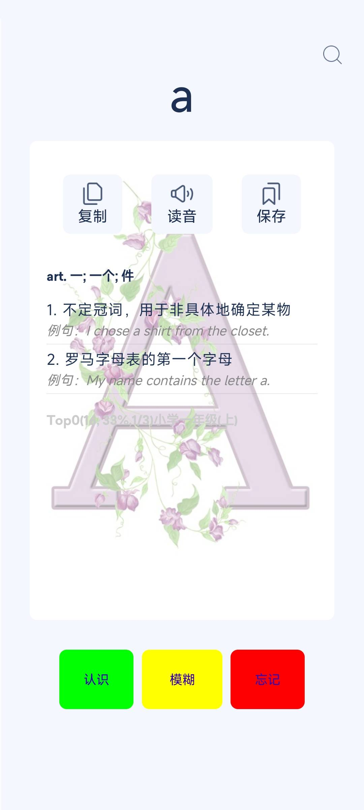
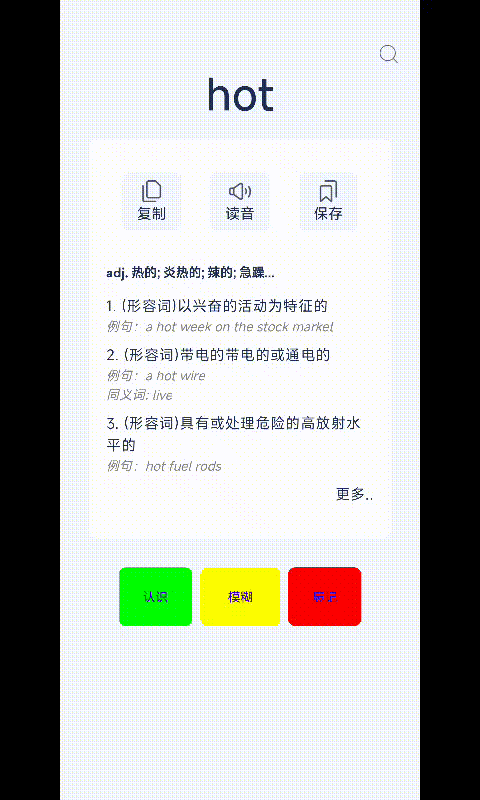

## edic ：electronic dictionary 电子词典 

## 是什么
* 英语学习工具
* 目的：替代纸质词典 支持 英英 英汉 双语，查英英词典才是扩大词汇量的最好办法。 
* 英英互译词典脱机词典，界面简单 例句的单击可以实现无限级跳转与返回
* 听写选择练习（默写单词不用人）
* 自定义单词列表 可分类可搜索 整理了高频词只要学会170个单词就可以覆盖50%的文章单词
* 历史搜索回忆更轻松
* 游戏： 滑词，单词字母重构，单词扩展词
* 界面多语言支持 目前支持英 汉 繁
* 支持深夜模式

### 高频词分析：
```java
数量     级别                单词出现频率                             分级规则
16      top0                1/3 单词出现概率33.2264%                >10000 
62      top1                1/10 	    10.9315%              >2000 
95      top2                1/17 	    6.01293%              >1000  合计：173个单词 50.1708%  
228     top3                1/14           7.28201%               >500
231     top4                1/22           4.46176%	          >350   合计: 632个单词 61.9146%
597     top5                1/13           7.32538%               >200   
1251    top6                1/12           8.15962%               >100   合计：2480个单词量 77.3996%
1911    top7                1/16           6.28518%               >50    
合计：4391 total    89.3569%
统计：采集单词数量：2143997  单词量：81439 统计时间：2024-12-06 来源：库中的10w+单词的英文注释和英文例句
```

## 来源
* 本项目来自开源项目 https://github.com/ezechuka/EnglishWhiz/
* 2024年5月开始接触到6月正式投入开发工作 10月底 时长5个月 1.0版本诞生。 由于合伙人放弃项目决定开源 希望能对需要的人有所帮助。
* 不要重复的造轮子 要善于发现和寻找 复用很重要。站在别人的肩膀上我们才能看的更远。 
* 技术不值钱 值钱的是执行力。

## 界面demo
<p>
    
    
    
    
    
    
    
</p>
## 操作demo
<table>
<tr ><td>
<br>
初始化
</td>
<td>
<br>
上下滑动
</td>
<td>
<br>
返回
</td>
<td>
<br>
单词展示方式
</td>
<td>
<br>
列表展示方式
</td>
</tr>
</table>
## 自定义的接口
在线资源地址：NetConf

